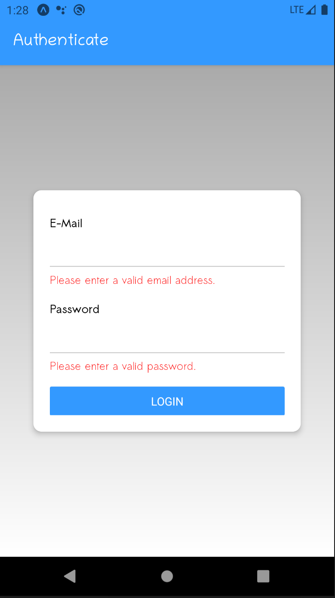
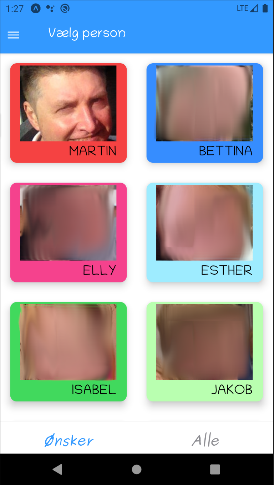
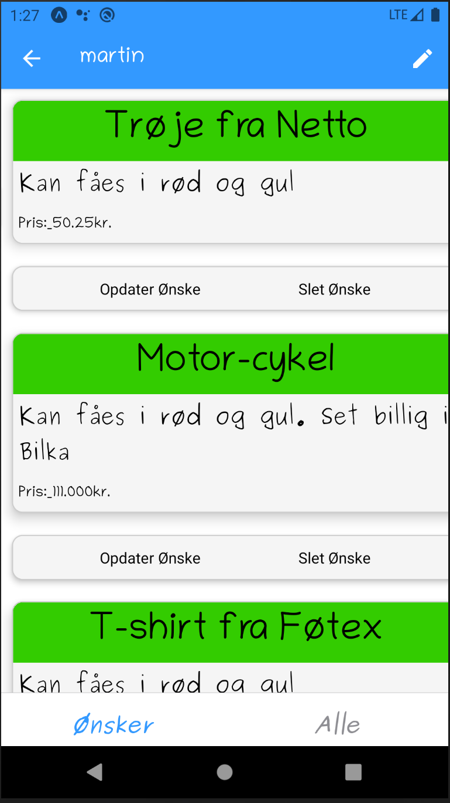

# GaveGuiden-RN

Wish list app made in React Native.
Functionality (see images below):
 - authenticate user using email and password
 - Show list of users
 - Show list of a users wishes
 - Show details of each wish
 - Create, update and delete your own wishes

Tech used:
- Expo: sdk 38
- react-navigation: v3

App language: danish at the moment

---
## Initial files for wishes-list project in react native

**config/firebaseConfig.js** file must be created. It contains database options (firebase API and key). Get info from the firebase console: 

    const firebaseConfig = {
      apiKey: "key",
      authDomain: "xyz.firebaseapp.com",
      databaseURL: "https://xyz.firebaseio.com",
      projectId: "xyz",
      appId: "large number",
    };

    export default firebaseConfig;

### Fonts

Make folder assets/fonts and put fonts in there. See App.js for font names. There are too many presently.

### Authentication
Authentication is at the moment made manually in the firebase console.

### Profiles
Profile info for each user are stored in firestore in a collection called users. Each document contains the following.
 - id: <from Authentication>
 - color: "#f5a442"
 - groupIds: ["1"]
 - imageUri: URL poiting to image
 - name: "name of person"

They are for the moment made manually in the firebase console.

### Data
There are dummy data in the data folder which can be used to fill database.  
Uncomment what is needed in **screens/wishes/PeopleWishesScreen.js**

---
### Usage

`yarn`  
`expo start`

---

